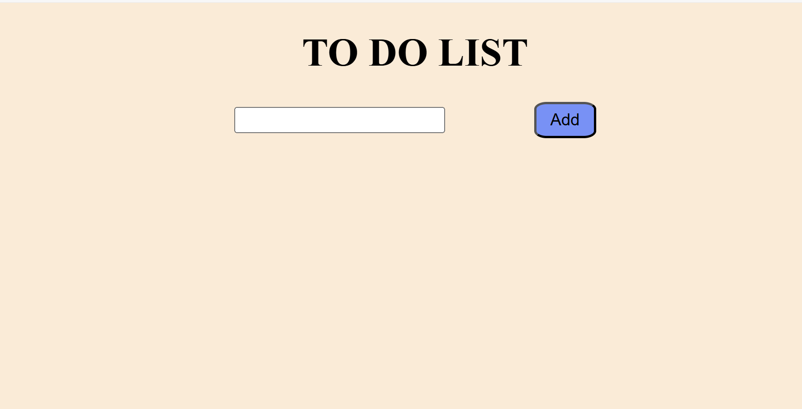
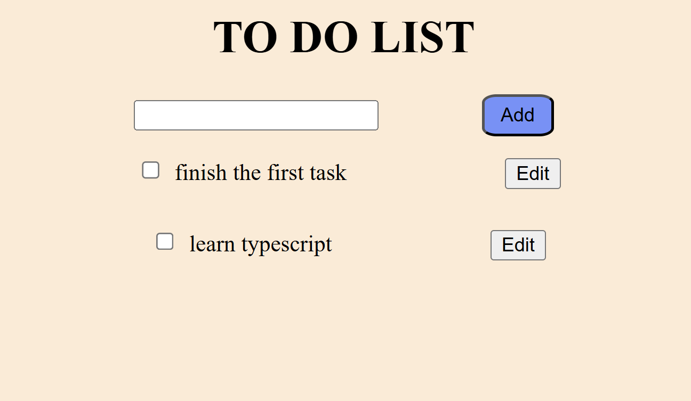

# TO-DO-LIST-APP-with-typecript

This is a simple To-Do List application built using HTML, CSS, and TypeScript. 

## Features

- **Add Tasks**: Users can input tasks and add them to the list.
- **Edit Tasks**: Users can edit the content of existing tasks.
- **Delete Tasks**: Users can remove tasks from the list by checking a checkbox.

## Getting Started

To run the application locally, follow these steps:

1. **clone the repository**
```bash 
git clone https://github.com/Rediet-W/Todo_list_app_with_Typescript.git

cd Todo_list_app_with_Typescript

tsc index.ts
    
open main.html
```



initial page with no task added

tasks added and with edit buttons and checkbox to mark/delete a task
# Todo_list_app_with_Typescript